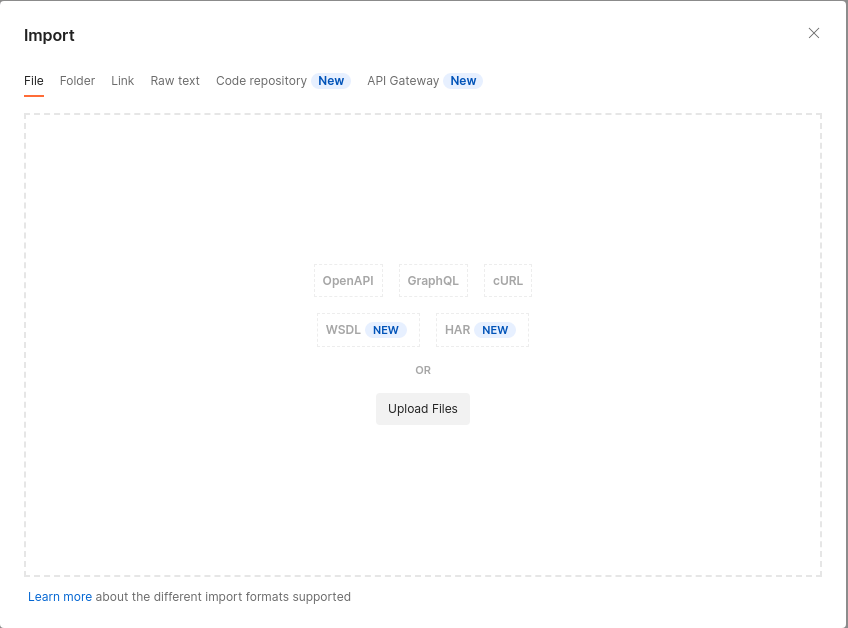
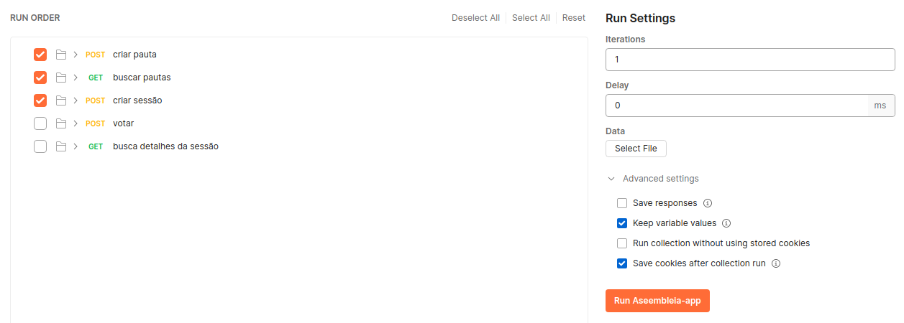
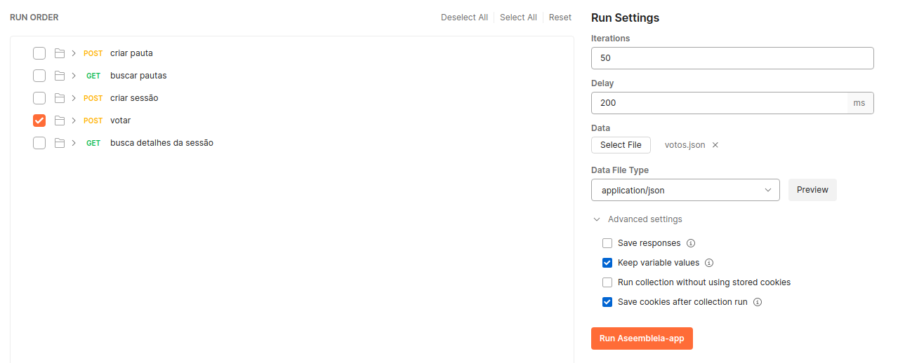
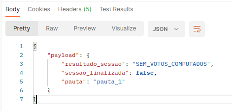

# Assembleia-app
Conjunto de API's para simular uma sessão de votos numa assembléia. 

## Pré-Requisitos

- Docker & Docker-compose instalados
- Java 11
- Redis 6.2
- Postman Version 9.30.4
- definir uma variável de ambiente para armazenar o password do redis: ${ASSEMBLEIA_REDIS_PASSWORD}

## Preparando container do Redis

Caso sua máquina local não possua o Redis 6.2 instalado, é possível criar um container
utilizando o [docker-compose](./docker-compose.yaml). Será necessário executar os passos a seguir:

- Criar um diretório para armazenar localmente os dados. **(~/redis/data)**
- Criar um diretório para armazenar localmente o arquivo de configuração do redis. **(~/redis/config)**
- Criar um arquivo de configuração do redis (redis.conf) no diretório **~/redis/config**
- Atribuir o valor da variável ${ASSEMBLEIA_REDIS_PASSWORD} à propriedade de configuraão **requirepass**

## Subindo a aplicação localmente

Na raiz do projeto, executar os seguintes comandos:

#### subir o container do redis:
docker-compose up -d

#### executar a aplicação com o profile local:
./mvnw clean install spring-boot:run -Dspring-boot.run.profiles=local

Se tudo correr bem, será possivel ver a mensagem "aplicação está de pé" nos logs de inicialização.

A documentação das API's poderá ser vista localmente através do link [assembleia-app](http://localhost:8080/assembleia/api/swagger-ui/)

## Testando a aplicação com o Postman

Através da collection [assembleia-app-collection](/collections/Aseembleia-app.postman_collection.json) é possível simular
uma sessão de votação, seguindo as seguintes etapas:

#### Importando a collection para o postman

**File --> import --> upload file --> path/to/assembleia-app-collection.json**

#### Editando as collections variables

**Collections --> Assembleia-app --> botão direito em cima da collection --> Edit**

| VARIABLE       | INITIAL VALUE |          CURRENT VALUE |
|----------------|:-------------:|-----------------------:|
| nome-pauta     |               |     ex: **minhaPauta** |
| duracao-sessao |               | ex: **1** (em minutos) |

## Executando a collection

Definidos os valores das variáveis **nome-pauta** e **duracao-sessao**, executar os seguintes passos:

#### Importar a collection para o runner

**File --> New Runner Tab**

Após a nova aba do runner ser aberta, arrastar a collection **Assembleia-app** para dentro do runner e selecionar
as ***três primeiras requisições*** para serem executadas e executar a collection clicando em **Run Assembleia-app**

#### Importar os votos dos usuários

Fazer o download do arquivo [votos-teste](collections/arquivos/votos.json) e em seguida importar para a collection:

**Run Settings --> Data --> Select File --> path/to/votos.json**

Selecionar a requisição **votar**, setar o número de iterações para **50**, o delay para **200ms** e em seguida
executar novamente a collection clicando em **Run Assembleia-app**

#### Visualizando o resultado da sessão

O resultado da sessão pode ser visto através da requisição **Busca detalhes da sessão**

